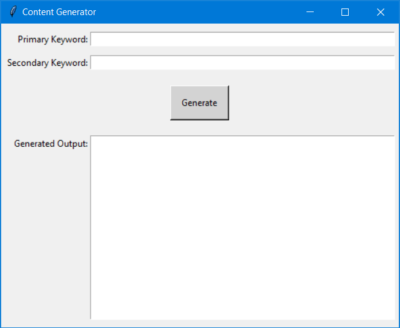
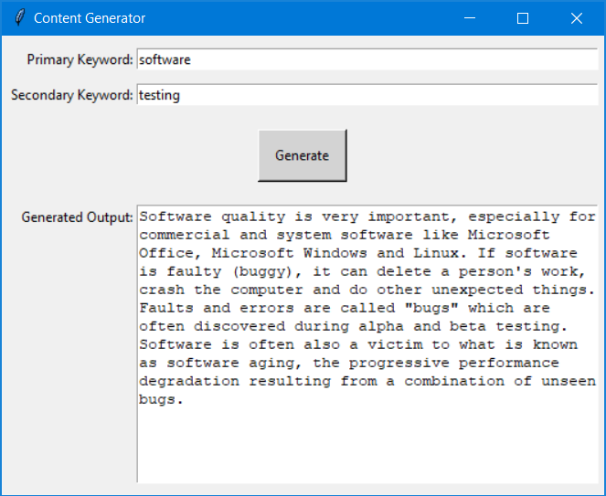

# content-generator
> Tkinter GUI that retrieves the primary keyword's Wikipedia article and displays a paragraph from that article with both keywords.

`pygame-sudoku` provides a GUI that allows user to play Sudoku. The board is a set board that can only be changed through the `sudoku.py` file.

## Download
All of the following instructions assumes that the user already has a valid version of Python 3.6+ installed.<br>
To download the program onto your personal computer:
```
git clone https://github.com/Kistler21/pygame-sudoku.git
```

## Usage
### Run the program:
**Windows:**
```
py content-generator.py
```
**Linux/macOS:**
```
python3 content-generator
```
<br>
### Generate Content
Simply fill in a primary keyword for the specified Wikipedia article that you want the program to search. For example, for the keyword `software`, the program will get the Wikipedia article located at https://en.wikipedia.org/wiki/Software.  
Next, fill in a secondary keyword and click the Generate button. The program will parse the content of the primary keyword's Wikipedia article and search for a paragraph that contains both the primary and secondary keyword. The image below shows the output with primary keyword `software` and secondary keyword `testing`.
<br>
### CSV Input
The program can also accept a CSV file as input. The CSV file must have a header line of `input_keywords` and the second line formatted as `primary keyword;secondary keyword`.  
**Windows:**
```
py content-generator.py input.csv
```
**Linux/macOS:**
```
python3 content-generator input.csv
```
**input.csv format**
```
input_keywords
software;testing
```
